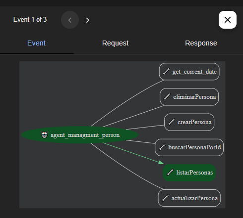
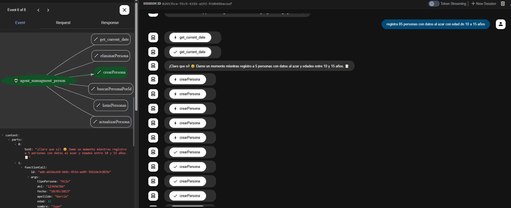
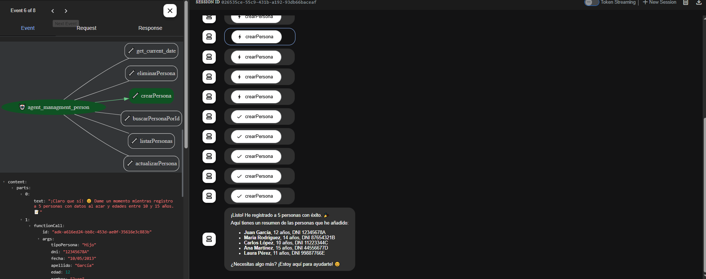

# ADK - MCP Client

Este proyecto implementa un cliente LLM (Large Language Model) utilizando Google Agent Development Kit (ADK) para la gestión de personas.

## Requisitos previos

- Python 3.9 o superior
- uv (gestor de paquetes moderno y rápido para Python)
- renombrar el archivo .env.copy a .env y pegar el apikey de google ai studio
- Acceso a la API de Google Gemini

## Instalación

1. Instala uv si aún no lo tienes:

```bash
pip install uv
```

2. Instala las dependencias usando uv:

```bash
uv venv
source .venv/Scripts/activate
uv sync

```

Esto instalará todas las dependencias definidas en el archivo `pyproject.toml`, incluyendo google-adk.

3. Ejecuta web de ADK:

```bash
adk web
```
4. Tools 


5. Ejemplo crear persona


