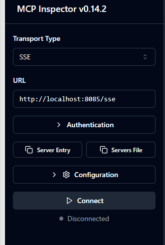
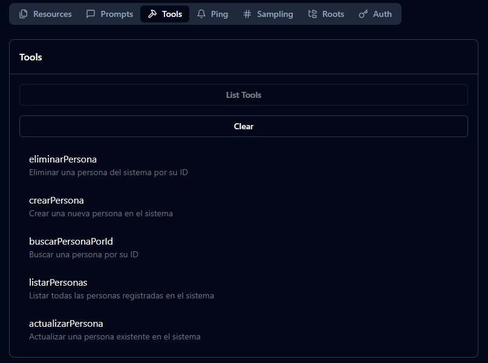

# Person Management System with MCP Server

This project implements a complete CRUD system for managing people using Spring WebFlux, R2DBC, H2 Database, and MCP Server Tools.

## Features

- **Spring WebFlux**: Reactive programming
- **R2DBC**: Reactive database access
- **H2 Database**: In-memory database
- **Lombok**: Reduce boilerplate code
- **MCP Server Tools**: Tools for AI system integration

## Data Model

### Person Entity
- **id**: Long (Auto-incremented)
- **nombre** (name): String (required)
- **apellido** (last name): String (required)
- **edad** (age): Integer (required)
- **fecha** (date): LocalDate (required)
- **tipoPersona** (person type): Enum (PADRE, MADRE, HIJO) - (FATHER, MOTHER, CHILD)
- **dni** (national ID): String (required, unique)


### Available MCP Tools

1. **listarPersonas** - List all people
   - Returns a list of all people in the system
   - No parameters required

2. **crearPersona** - Create a new person
   - Parameters:
     - `nombre` (required): Person's first name
     - `apellido` (required): Person's last name
     - `edad` (required): Person's age
     - `fecha` (required): Birth date in dd/MM/yyyy format
     - `tipoPersona` (required): Person type (PADRE, MADRE, HIJO)
     - `dni` (required): National ID (must be unique)

3. **actualizarPersona** - Update an existing person
   - Parameters:
     - `id` (required): Person's ID
     - `nombre` (required): Person's first name
     - `apellido` (required): Person's last name
     - `edad` (required): Person's age
     - `fecha` (required): Birth date in dd/MM/yyyy format
     - `tipoPersona` (required): Person type (PADRE, MADRE, HIJO)
     - `dni` (required): National ID (must be unique)

4. **eliminarPersona** - Delete a person
   - Parameters:
     - `id` (required): Person's ID

5. **buscarPersonaPorId** - Find a person by ID
   - Parameters:
     - `id` (required): Person's ID

### Inspector MCP
1. execute inspector
```bash
npx @modelcontextprotocol/inspector
```
2. connect with

3. tool list
